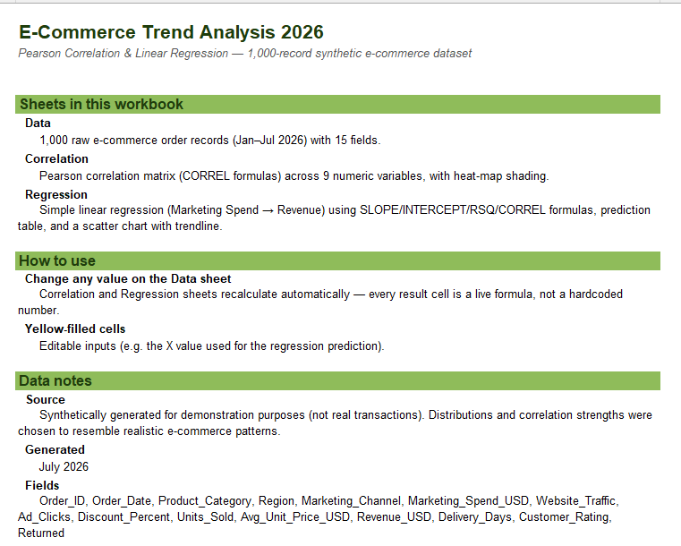
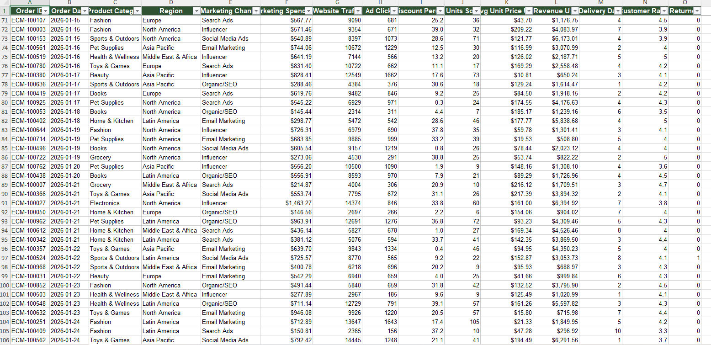
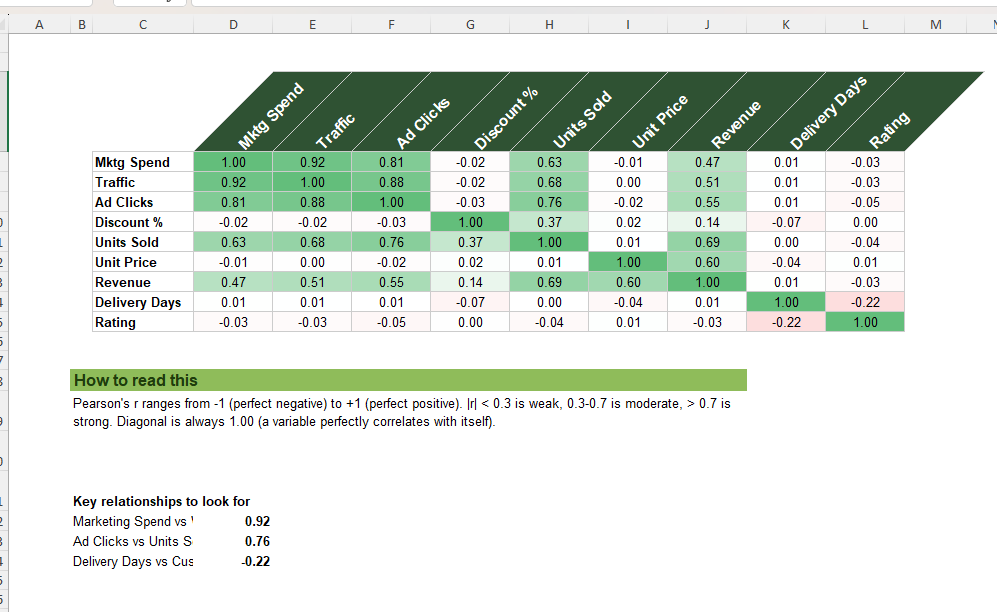
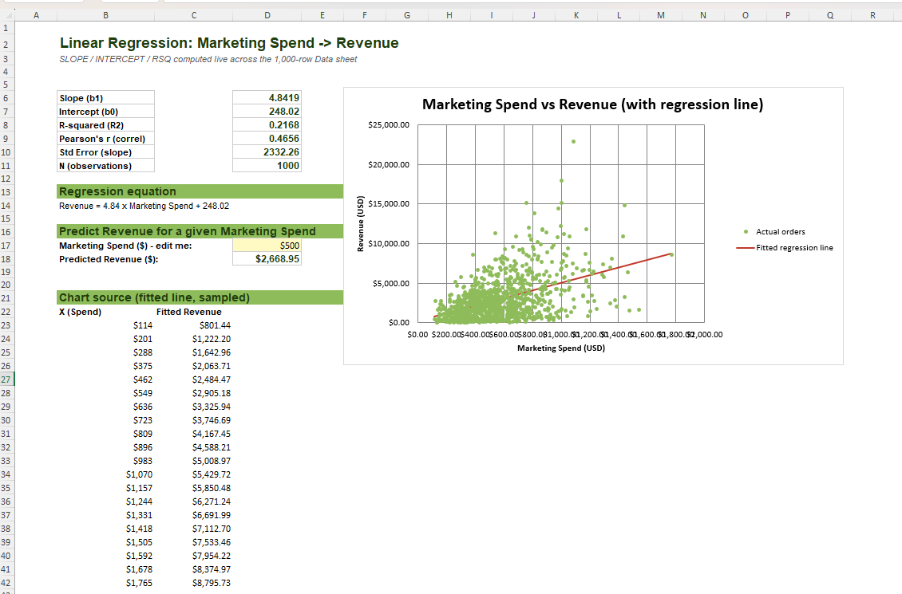

# E-Commerce Correlation & Regression Analysis (2026)

Pearson correlation and simple linear regression analysis on a 1,000-record
synthetic e-commerce dataset, built entirely in Excel with live formulas.

## Screenshots

## Files

| File | Description |
| --- | --- |
| `Ecommerce_Correlation_Regression_2026.xlsx` | The full analysis workbook (data, correlation matrix, regression + chart) |
| `README.md` | This file |
| `LICENSE` | MIT License |

## Workbook structure

- **Overview** — summary of what's in the workbook and how to use it.
- **Data** — 1,000 e-commerce order records (Jan–Jul 2026), 15 fields: order ID,
  date, product category, region, marketing channel, marketing spend, website
  traffic, ad clicks, discount %, units sold, unit price, revenue, delivery
  days, customer rating, returned flag.
- **Correlation** — a 9×9 Pearson correlation matrix built with `CORREL()`
  formulas, color-scaled from red (−1) to green (+1), plus three highlighted
  key relationships.
- **Regression** — simple linear regression of **Revenue on Marketing Spend**
  using `SLOPE`, `INTERCEPT`, `RSQ`, `CORREL`, and `STEYX`; a live prediction
  calculator (edit the yellow cell); and a scatter chart with the fitted
  regression line overlaid on the raw data.

Every statistic is a live formula referencing the Data sheet — edit any row on
Data and the correlation matrix, regression stats, equation, prediction, and
chart all recalculate automatically. No hardcoded results.

## Key findings (from the included dataset)

- **Marketing Spend ↔ Website Traffic**: strong positive correlation (r ≈ 0.92)
- **Marketing Spend ↔ Revenue**: moderate positive correlation (r ≈ 0.47,
  R² ≈ 0.22) — spend matters, but pricing, discounts, and conversion noise
  explain most of the remaining variance
- **Delivery Days ↔ Customer Rating**: weak negative correlation — slower
  delivery mildly hurts satisfaction

## Data notes

This dataset is **synthetically generated for demonstration purposes** — it
does not represent real transactions from any company. Variable distributions
and correlation strengths were deliberately chosen to resemble realistic
e-commerce patterns (e.g. spend driving traffic more reliably than it drives
final revenue). Random seed is fixed for reproducibility.

## Requirements

Microsoft Excel 2016+ (or LibreOffice Calc / Google Sheets — chart rendering
may vary slightly between programs).

## License

MIT — see [LICENSE](LICENSE).

## Author

Uzma EJaz
