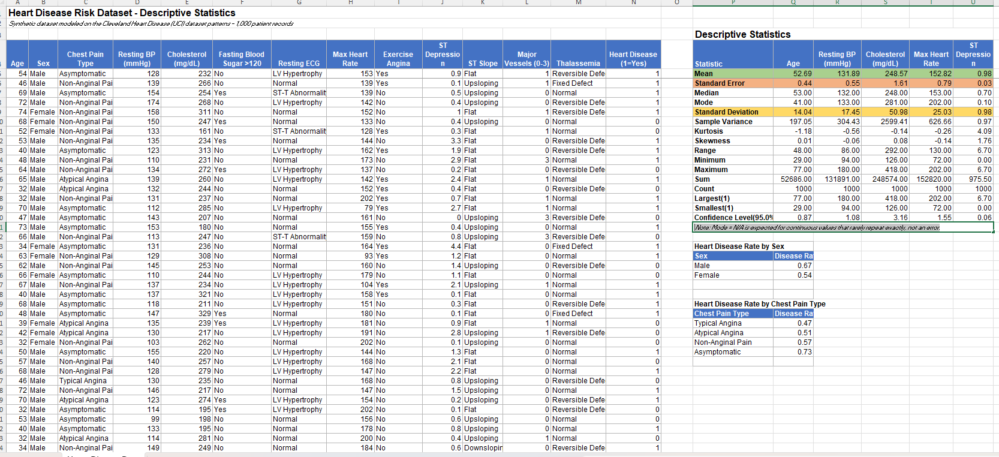
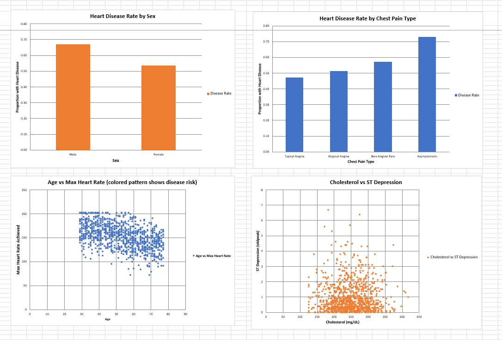

# Heart Disease Risk Dataset - Descriptive Statistics (Excel)

A descriptive statistics and visualization project analyzing 1,000 patient records modeled on the well-known Cleveland Heart Disease (UCI) dataset — the same dataset widely used to teach and demo AI-based disease prediction.

## What this project does

- 1,000 patient records with 14 clinical fields: Age, Sex, Chest Pain Type, Resting Blood Pressure, Cholesterol, Fasting Blood Sugar, Resting ECG, Max Heart Rate, Exercise-Induced Angina, ST Depression, ST Slope, Major Vessels, Thalassemia, and Heart Disease outcome
- Full **Descriptive Statistics table** (same sheet) for Age, Resting BP, Cholesterol, Max Heart Rate, and ST Depression — the complete 16-statistic set matching Excel's Data Analysis ToolPak: Mean, Standard Error, Median, Mode, Standard Deviation, Sample Variance, Kurtosis, Skewness, Range, Minimum, Maximum, Sum, Count, Largest(1), Smallest(1), Confidence Level(95.0%)
- **4 charts** on the same sheet:
  1. Heart disease rate by sex
  2. Heart disease rate by chest pain type
  3. Age vs Max Heart Rate (scatter)
  4. Cholesterol vs ST Depression (scatter)

## What each column means

| Column | What it measures |
|---|---|
| Chest Pain Type | Typical/Atypical Angina, Non-Anginal Pain, or Asymptomatic |
| Resting BP | Blood pressure at rest, mmHg |
| Cholesterol | Serum cholesterol, mg/dL |
| Fasting Blood Sugar | Whether it's above 120 mg/dL (a diabetes marker) |
| Max Heart Rate | Highest heart rate reached during a stress test |
| Exercise Angina | Whether exercise triggers chest pain |
| ST Depression (oldpeak) | ECG measurement indicating heart stress |
| Major Vessels | Number of major vessels (0-3) showing blockage on imaging |
| Thalassemia | A blood disorder marker also linked to heart risk in this dataset |

## Why this dataset

This is the same style of data AI models use for early heart-disease risk prediction — combining age, blood pressure, cholesterol, and stress-test results into a risk score. This version is synthetically generated to reflect realistic clinical relationships (e.g., higher cholesterol + exercise angina + more blocked vessels → higher disease rate) for practice purposes — it does not represent actual patient records.

## How to use

1. Download `Heart_Disease_Descriptive_Statistics.xlsx`
2. Open in Microsoft Excel (best viewed in real Excel rather than lightweight online viewers)
3. Review the Descriptive Statistics table for each numeric metric
4. Explore the 4 charts to see how sex, chest pain type, age, and cholesterol relate to heart disease risk

## Skills demonstrated

- Full descriptive statistics suite (Data Analysis ToolPak-equivalent, built with live formulas)
- Conditional aggregation (`AVERAGEIF`) for rate-by-category breakdowns
- Multiple chart types (bar, scatter) on a single sheet
- Realistic synthetic data generation reflecting known clinical risk patterns

## License

All rights reserved — see [`LICENSE`](LICENSE) for terms.

## Author
Uzma Ejaz
