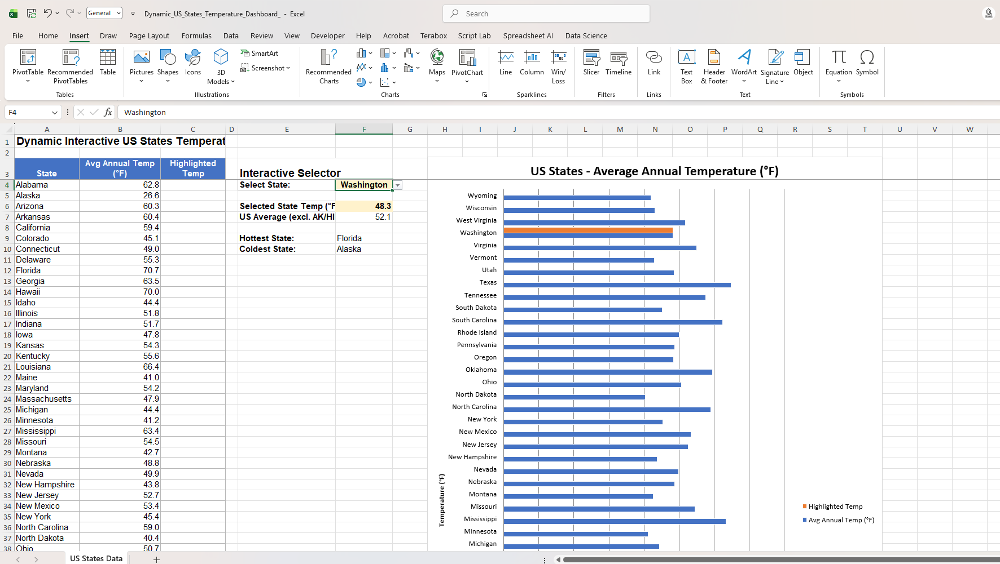

# Dynamic Interactive US States Temperature Dashboard (Excel)

An interactive Excel dashboard that lets you pick any US state from a dropdown and instantly highlight it on a live bar chart comparing average annual temperatures across all 50 states.

## What this project does

- Displays average annual temperature (°F) for all 50 US states
- A dropdown selector (Data Validation list) lets the user pick any state
- The selected state's bar turns **orange** on the chart while all others stay **blue**
- Bonus stats update live: selected state's temp, US average (excluding Alaska/Hawaii), hottest state, coldest state

## How it works (Excel skills used)

| Feature | Formula / Tool |
| --- | --- |
| Dropdown menu | Data Validation → List, source = state name range |
| Highlight selected state | `=IF(A4=$F$4,B4,"")` |
| Look up selected state's temperature | `=VLOOKUP(F4,A4:B53,2,0)` |
| US average (excluding Alaska & Hawaii) | `=(SUM(range)-Alaska-Hawaii)/(COUNT(range)-2)` |
| Hottest / coldest state | `=INDEX(A:A,MATCH(MAX(B:B),B:B,0))` and `MIN` version |
| Chart auto-update | Bar chart plotting Temp + Highlighted Temp columns |

Every value is formula-driven — change any state's temperature and the chart and stats recalculate automatically.

## Data source

Average annual state temperatures (1971–2000 NOAA Climate Normals), via
[Current Results — Average Annual Temperatures by USA State](https://www.currentresults.com/Weather/US/average-annual-state-temperatures.php).

## How to use

1. Download `Dynamic_US_States_Temperature_Dashboard.xlsx`
2. Open in Microsoft Excel (dropdown + chart interactivity require Excel — GitHub's file preview only shows raw data, not the working dashboard)
3. Click the dropdown next to **Select State** and choose any state
4. Watch the chart and stats update instantly

## Skills demonstrated

- Data Validation (dropdown lists)
- Conditional/dynamic formulas (`IF`, `VLOOKUP`, `INDEX`/`MATCH`)
- Dynamic chart series driven by helper columns
- Real-world data sourcing and cleaning
